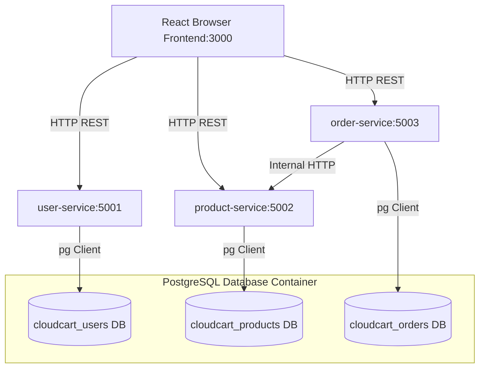

# CloudCart: Microservices E-Commerce Platform

Welcome to **CloudCart**, a production-style, realistic microservices application designed as a learning blueprint for modern DevOps practices. 

This repository serves as a sandbox for implementing:
- Containerization (Docker, Multi-stage builds)
- Orchestration (Docker Compose, Kubernetes, Helm, Kustomize)
- CI/CD & GitOps (Jenkins, GitHub Actions, ArgoCD)
- Observability (Prometheus, Grafana, Loki)
- Security (Non-root containers, Trivy Vulnerability Scanning)

---

## 1. System Architecture

CloudCart is split into three decoupled backend services, a database container (using database-per-service isolation), and a compiled React frontend.



### Components
1. **Frontend (React + Vite)**: Port `3000`. SPA using React Router, Axios, and global state tracking for authentication sessions and cart items. Serves static files via a custom secure **Nginx** server.
2. **User Service (Node.js + Express)**: Port `5001`. Manages credentials, signs JWT authentication tokens, and provides user profiles.
3. **Product Service (Node.js + Express)**: Port `5002`. Exposes products catalogs, details, and filtering endpoints.
4. **Order Service (Node.js + Express)**: Port `5003`. Manages checkouts and order histories. Uses transaction operations (`BEGIN/COMMIT`) to ensure consistency.
5. **Database (PostgreSQL 16)**: Port `5432`. Segregated into three databases initialized by a startup shell script.

---

## 2. Docker & Multi-Stage Strategy

Each service is Dockerized using **multi-stage builds** to maximize performance, secure the execution context, and keep container sizes minimal.

### Backend Dockerfiles
- **Stage 1 (Builder)**: Uses `node:20-alpine` to download dev and production packages, copies the full codebase, and runs compile/audit check steps.
- **Stage 2 (Production)**: Starts from a fresh `node:20-alpine` base. Installs *only* production dependencies (`npm ci --only=production`) and copies *only* the compiled scripts.
- **Non-Root Execution**: Runs under the standard system user `node` rather than `root` to mitigate directory traversal exploits.
- **Native Health Check**: Periodically triggers a Node fetch script to test the `/health` endpoint without needing `curl`/`wget` binaries installed.

### Frontend Dockerfile
- **Stage 1 (Builder)**: Installs dependencies and runs `npm run build` to compile the Vite/React app into static JS/HTML assets (`dist/`).
- **Stage 2 (Nginx)**: Copies the built files into an unprivileged Nginx server (`nginxinc/nginx-unprivileged:alpine`) and starts a web listener.
- **Nginx Configuration**: Includes a custom `nginx.conf` routing fallback (`try_files $uri $uri/ /index.html;`) to support React Router client-side path changes.

---

## 3. Docker Compose Infrastructure

The orchestrated containers run in a unified network layout.

```yaml
# Summary of docker-compose.yml structure
services:
  postgres:         # Database with persistent named volume and DB-init script mounts.
  user-service:     # User APIs. Starts only after postgres healthcheck passes.
  product-service:  # Catalog APIs. Starts only after postgres healthcheck passes.
  order-service:    # Order placement. Communicates with product-service internally.
  frontend:         # SPA server. Compiles Vite client routing endpoints.
```

### Key Orchestration Design Patterns
- **Depends_On Healthchecks**: Backend microservices wait for the database container to return a status of `service_healthy` (using `pg_isready`) before executing. This avoids connection crash loops.
- **Persistent Volumes**: Postgres data is written to a named Docker volume (`postgres-data`) to prevent data loss when containers are stopped or re-created.
- **Client-Side vs Container DNS**: The `order-service` calls the `product-service` internally using Docker DNS (`http://product-service:5002`). However, the frontend runs in the client browser, so its environment variables point to `http://localhost:5001/5002/5003` to route through host mappings.

---

## 4. Quick Start: Run Locally

### Prerequisites
Make sure you have [Docker](https://docs.docker.com/get-docker/) and [Docker Compose](https://docs.docker.com/compose/install/) installed.

### Steps

1. **Clone the repository** (or navigate to the workspace directory).
2. **Configure environment files**:
   ```bash
   cp .env.example .env
   ```
3. **Build and spin up the microservices**:
   ```bash
   docker compose up -d --build
   ```
4. **Monitor service status**:
   ```bash
   docker compose ps
   ```
5. **Inspect the startup logs**:
   ```bash
   docker compose logs -f
   ```

Once all containers are running and healthy, open your browser and navigate to:
**[http://localhost:3000](http://localhost:3000)**

---

## 5. API Testing & Verification Guide

You can test and verify the endpoints using standard CLI `curl` requests.

### 1. Register a User
```bash
curl -X POST http://localhost:5001/api/users/register \
  -H "Content-Type: application/json" \
  -d '{"name": "Alice Developer", "email": "alice@cloudcart.dev", "password": "securepassword123"}'
```
*Response contains JWT token and user profile.*

### 2. Login User
```bash
curl -X POST http://localhost:5001/api/users/login \
  -H "Content-Type: application/json" \
  -d '{"email": "alice@cloudcart.dev", "password": "securepassword123"}'
```
*Extract the `"token"` value from the response to use in the protected endpoints below.*

### 3. View User Profile (Protected)
```bash
# Replace <JWT_TOKEN> with your actual login token
curl -X GET http://localhost:5001/api/users/profile \
  -H "Authorization: Bearer <JWT_TOKEN>"
```

### 4. Fetch Products Catalog (Public)
```bash
# Get all products
curl -X GET http://localhost:5002/api/products

# Filter products by category
curl -X GET "http://localhost:5002/api/products?category=Electronics"
```

### 5. Place an Order (Protected & Dynamic Validation)
```bash
# Order elements are verified against the product database inside a transaction
curl -X POST http://localhost:5003/api/orders \
  -H "Authorization: Bearer <JWT_TOKEN>" \
  -H "Content-Type: application/json" \
  -d '{"items": [{"product_id": 1, "quantity": 1}, {"product_id": 3, "quantity": 2}]}'
```

### 6. Retrieve Order History (Protected)
```bash
curl -X GET http://localhost:5003/api/orders \
  -H "Authorization: Bearer <JWT_TOKEN>"
```

---

## 6. DevOps Preparation & Future Deployment

This repository structure has been carefully prepared for advanced DevOps practices:

- **Jenkins CI/CD**: Each microservice directory has its own isolated package configuration, making it easy to create pipeline stages that trigger independent builds, run Docker builds, and push to container registries.
- **Trivy Vulnerability Scans**: By using clean `node:alpine` and unprivileged Nginx images, CVE scan reports will remain clean and ready to pass strict pipeline gates.
- **Kubernetes Ready**: To migrate to EKS or local Minikube:
  1. Define independent deployment files for each service.
  2. Implement Kubernetes `ClusterIP` services to map internal DNS (e.g. `http://product-service:5002`).
  3. Create an Ingress Controller (like Nginx Ingress or AWS ALB Controller) to route `/api/users/*`, `/api/products/*`, and `/api/orders/*` to their corresponding pods, solving CORS requirements in cloud environments.
  4. Convert variables to Kubernetes ConfigMaps and Secrets.
 
## 🔗 Related Repositories

This GitOps repository works hand-in-hand with our infrastructure repository to deliver a fully automated end-to-end cloud platform:

*   🚀 **Gitops Repo:** https://github.com/Roshan0102/online-boutique-gitops/
*   🏗️ **Infrastructure Repo:** [Roshan0102/eks-platform-infra](https://github.com/Roshan0102/eks-platform-infra)

## 🛠️ How it Works
